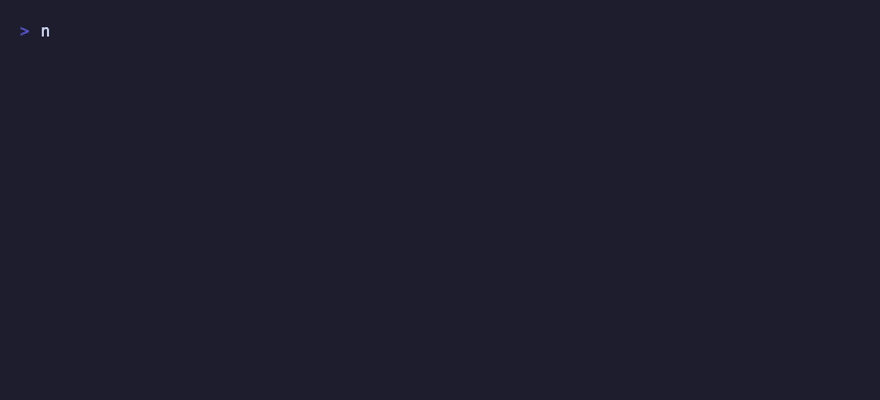
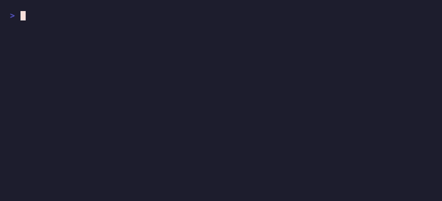
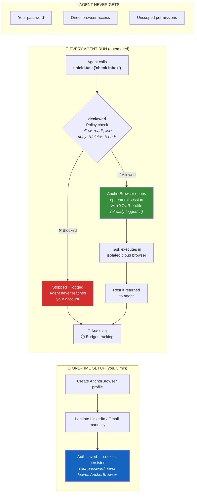

# declawed

> Your AI agent has your credentials. This gives it rules.

Policy, audit, kill switch for OpenClaw agents, AI work assistants, and any bot with access to your accounts.

[](https://www.npmjs.com/package/declawed)
[](./LICENSE)
[](#)

### OpenClaw sales bot — declawed



### Work assistant (Claude, Devin, etc.) — declawed



## The Problem

[42,000 live credentials leaked](https://www.wired.com/story/ai-agent-credential-leaks/) from AI agent workflows. The community's response? Buy a separate Mac Mini. **declawed replaces the Mac Mini** — software governance instead of hardware isolation.

## Quick Start

You need an [AnchorBrowser](https://anchorbrowser.io) API key: `export ANCHOR_API_KEY=your-key`

### 1. Install

```bash
npm install declawed
```

### 2. Write a policy

Create `shield.yaml`:

```yaml
agent: my-openclaw-sales-bot
rules:
  allow:
    - "read*"
    - "list*"
    - "check*"
    - "search*"
  deny:
    - "*send*"
    - "*delete*"
    - "*export*"
    - "*password*"
default: deny
expire_after: 60min
max_actions: 50
```

### 3. Wrap your agent

```typescript
import { createShield } from 'declawed'

const shield = createShield('./shield.yaml')

const result = await shield.task('check linkedin inbox')
// → { allowed: true, output: '...' }

const result2 = await shield.task('export all contacts to CSV')
// → { allowed: false, reason: 'blocked by deny pattern: *export*' }
```

That's it. Every `shield.task()` call is policy-checked, audited, and budgeted.

## How It Protects You

Your credentials live in AnchorBrowser, not in your code. Your agent never sees your password — it gets a scoped, ephemeral session, and declawed controls what it can do.

**Three layers of protection:**

1. **Credential isolation** — your password stays in AnchorBrowser. The agent gets a pre-authenticated session, never the credentials themselves.
2. **Scoped permissions** — the agent can only do what your policy allows. Read inbox? Yes. Delete contacts? Blocked. It can't go beyond the scope you define.
3. **Audit + kill switch** — every action logged (allowed and blocked). Budget enforced. Instant session destruction when you're done.



## CLI

```bash
npx declawed status   # Agent: my-openclaw-sales-bot | Allowed: 23 | Blocked: 3
npx declawed audit    # Full audit trail
npx declawed kill     # Kill switch — destroy session immediately
```

[Full API reference & policy examples →](./docs/API.md)

## Empowered by AnchorBrowser

declawed runs on [AnchorBrowser](https://anchorbrowser.io) — ephemeral, hardened cloud browser sessions purpose-built for AI agents. Each session is isolated, auto-expires, and leaves no trace. [Cloudflare](https://cloudflare.com) verified bot partner. SOC2 Type 2 and ISO27001 certified. Trusted by [Google](https://google.com), [Coinbase](https://coinbase.com), and [Composio](https://composio.dev). Stealth proxies, CAPTCHA solving, anti-fingerprinting, and full session isolation out of the box.

AnchorBrowser handles the browser. declawed handles the rules.

[Get an API key →](https://anchorbrowser.io)

## Why This Exists

AI agents are getting credential access with zero governance — 42,000 live credentials exposed, and the best workaround is buying separate hardware. `declawed` gives agents what they should have had from the start: **a policy file, an audit log, and a kill switch.**

Built by [Behalf](https://behalf-gray.vercel.app) — delegation governance for the agent era.

## License

MIT
