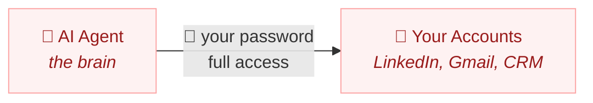
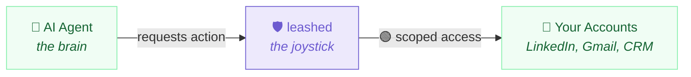

# leashed

> AI got hands. This is the leash.

Policy, audit, kill switch for any AI agent with access to your accounts.

[](https://www.npmjs.com/package/leashed)
[](./LICENSE)
[](#)

**[See the full showcase →](https://behalf.work/harness/)**

### OpenClaw sales bot — leashed


### Work assistant (Claude, Devin, etc.) — leashed


## The Problem

[42,000 live credentials leaked](https://www.wired.com/story/ai-agent-credential-leaks/) from AI agent workflows. The community's response? Buy a separate Mac Mini. **leashed replaces the Mac Mini** — software governance instead of hardware isolation.

## Quick Start

You need an [AnchorBrowser](https://anchorbrowser.io) API key: `export ANCHOR_API_KEY=your-key`

### 1. Install

```bash
npm install leashed
```

### 2. Write a policy

Create `leash.yaml`:

```yaml
agent: my-openclaw-sales-bot
rules:
  allow:
    - "read*"
    - "list*"
    - "check*"
    - "search*"
  deny:
    - "*send*"
    - "*delete*"
    - "*export*"
    - "*password*"
default: deny
expire_after: 60min
max_actions: 50
```

### 3. Wrap your agent

```typescript
import { createLeash } from 'leashed'

const leash = createLeash('./leash.yaml')

const result = await leash.task('check linkedin inbox')
// → { allowed: true, output: '...' }

const result2 = await leash.task('export all contacts to CSV')
// → { allowed: false, reason: 'blocked by deny pattern: *export*' }
```

That's it. Every `leash.task()` call is policy-checked, audited, and budgeted.

## Common Use Cases

People give agents their passwords every day. Here's what they're afraid of — and how `leashed` fixes it.

### 1. LinkedIn Sales Agent (OpenClaw)

**The fear:** Your bot has your LinkedIn password. It's supposed to read your inbox and check messages. But what if it starts mass-connecting, exporting contacts, or changing your profile?

**With leashed:**

```yaml
agent: linkedin-sales-bot
rules:
  allow:
    - "read*"
    - "list*"
    - "check*"
    - "search*"
  deny:
    - "*send*"
    - "*connect*"
    - "*export*"
    - "*settings*"
    - "*password*"
default: deny
expire_after: 60min
max_actions: 50
```

Read inbox, check messages — allowed. Mass-connect, export contacts — blocked before it starts.

### 2. Email & Calendar Assistant

**The fear:** Your assistant has your Gmail. It reads your calendar and summarizes emails. But what if it deletes messages, forwards sensitive emails externally, or changes your billing settings?

**With leashed:**

```yaml
agent: daily-briefing
rules:
  allow:
    - "read*"
    - "list*"
    - "check*"
    - "summarize*"
  deny:
    - "*delete*"
    - "*forward*"
    - "*billing*"
    - "*settings*"
    - "*password*"
default: deny
expire_after: 30min
max_actions: 100
```

Read calendar, list emails, summarize threads — allowed. Delete, forward, change settings — blocked.

### 3. CRM Data Entry Bot

**The fear:** Your bot updates Salesforce records from your email threads. But what if it bulk-deletes contacts, exports your pipeline, or modifies deal values?

**With leashed:**

```yaml
agent: crm-updater
rules:
  allow:
    - "read*"
    - "update*"
    - "list*"
    - "search*"
  deny:
    - "*delete*"
    - "*export*"
    - "*bulk*"
    - "*admin*"
    - "*billing*"
default: deny
expire_after: 45min
max_actions: 200
```

Read records, update fields, search contacts — allowed. Bulk-delete, export pipeline, admin changes — blocked.

---

## AI got hands. We control the grip.

Think of a crane operator. The brain decides what to move — but the joystick decides how far the arm can reach. **leashed is the joystick between the AI agent and your accounts.**

### Without leashed



> **The agent IS you.** Full access. No limits. No off switch.

### With leashed



> **The agent works through controlled arms.** You decide what moves.

| | |
|---|---|
| ✅ read inbox | ✅ list messages |
| ❌ delete data | ❌ export contacts |
| ⏱️ 60 min limit | 🔢 50 actions max |

> *A crane operator doesn't carry the steel himself. He moves joysticks that control arms — limited to a work zone, every movement tracked, with an emergency stop within reach. That's what leashed does for AI agents.*

### Three layers of protection

1. **Credential isolation** — your password stays in an isolated cloud browser. The agent gets a pre-authenticated session, never the credentials themselves.
2. **Scoped boundaries** — tasks that don't match your policy are blocked before they start. Deny-first pattern matching with Unicode bypass protection.
3. **Audit + kill switch** — every action logged (allowed and blocked). Budget enforced. Session destruction when you're done.

## Security Model

In security terms, leashed is **application-layer authz for AI agents** — it governs what agents are *authorized to do*, not who they are or what credentials they hold. Think of it like an AWS IAM policy that checks what you *request*, not what the underlying service *executes*.

### What leashed enforces today (v0.1)

| Layer | Enforced | How |
|-------|----------|-----|
| Task gating | Yes | Deny-first glob pattern matching on task strings |
| Time + action budgets | Yes | Configurable expiration and action limits |
| Credential isolation | Yes | Passwords stay in AnchorBrowser's isolated session, never exposed to the agent |
| Session destruction | Yes | `leash.yank()` destroys the cloud browser session |
| Audit trail | Yes | Every task request (allowed + blocked) logged to JSONL |
| Unicode bypass protection | Yes | Strips zero-width chars, combining marks, BiDi controls |

### What leashed does NOT enforce (yet)

| Layer | Status | Why |
|-------|--------|-----|
| Browser action validation | Roadmap (v1.0) | AnchorBrowser executes tasks autonomously — leashed has no visibility into actual browser clicks/navigation |
| URL/domain restrictions | Roadmap (v1.0) | Requires AnchorBrowser session-level allowlists (not yet available in their SDK) |
| Semantic equivalence | By design | `"forward email"` and `"send email to myself"` are different strings — glob patterns match literally, not semantically |

### The honest version

The policy engine checks the **task description string** — the human-readable instruction you pass to `leash.task()`. If the string matches a deny pattern, it never reaches the browser. If it's allowed, AnchorBrowser's AI executes it autonomously.

This means: a well-intentioned agent that uses descriptive task names gets real governance. A deliberately adversarial agent that lies about what it's doing can bypass pattern matching — just like a developer with an IAM read-only key could name their Lambda "ReadOnlyFunction" while it actually writes to S3.

**leashed is a seatbelt, not a cage.** It stops the 95% of accidents that come from misconfiguration, scope creep, and unintended actions. It does not stop a determined attacker with direct API access.

For defense-in-depth, see [SECURITY.md](./SECURITY.md).

## CLI

```bash
npx leashed status   # Agent: my-openclaw-sales-bot | Allowed: 23 | Blocked: 3
npx leashed audit    # Full audit trail
npx leashed yank     # Kill switch — destroy session immediately
```

[Full API reference & policy examples →](./docs/API.md)

## Roadmap

leashed is v0.1 — the governance primitives. Here's what's coming:

### v0.2 — Output Scanning
- Post-execution validation: scan AnchorBrowser output for policy-violating content
- Domain hints in policy: `domains: [linkedin.com]` for documentation and audit enrichment
- Structured output schemas for safer result parsing

### v1.0 — Session-Level Enforcement (with AnchorBrowser)
- URL allowlists at the session level — the browser itself refuses to navigate outside your policy
- Browser action audit trail — not just task requests, but actual clicks, form fills, and navigation
- Webhook callbacks for real-time policy violation alerts
- This is the "IAM enforcement" layer — restrictions enforced by the infrastructure, not just the intent

Want to help shape v1.0? [Open an issue](https://github.com/dormstern/leashed/issues) or reach out.

## Empowered by AnchorBrowser

leashed runs on [AnchorBrowser](https://anchorbrowser.io) — ephemeral, hardened cloud browser sessions purpose-built for AI agents. Each session is isolated, auto-expires, and leaves no trace. [Cloudflare](https://cloudflare.com) verified bot partner. SOC2 Type 2 and ISO27001 certified. Trusted by [Google](https://google.com), [Coinbase](https://coinbase.com), and [Composio](https://composio.dev). Stealth proxies, CAPTCHA solving, anti-fingerprinting, and full session isolation out of the box.

AnchorBrowser handles the browser. leashed handles the rules.

[Get an API key →](https://anchorbrowser.io)

## Why This Exists

[Behalf](https://behalf.work) already powers safe delegation for humans — scoped sessions, audit trails, and instant revocation for people who delegate work through their accounts. We built the trust infrastructure, battle-tested it, and realized: **agents need the exact same thing.**

42,000 live credentials leaked from AI agent workflows. The community's best workaround is buying a separate Mac Mini. That's not security — that's surrender.

So we open-sourced the engine. `leashed` gives agents what they should have had from the start: **a policy file, an audit log, and a kill switch.** The same trust model that protects human delegation — now available for every agent operator.

Half the access. All the work done.

## License

MIT
