# declawed

> Your AI agent has your credentials. This gives it rules.

Policy, audit, kill switch for OpenClaw agents, AI work assistants, and any bot with access to your accounts.

[](https://www.npmjs.com/package/declawed)
[](./LICENSE)
[](#)

### OpenClaw sales bot — declawed


### Work assistant (Claude, Devin, etc.) — declawed


## The Problem

[42,000 live credentials leaked](https://www.wired.com/story/ai-agent-credential-leaks/) from AI agent workflows. The community's response? Buy a separate Mac Mini. **declawed replaces the Mac Mini** — software governance instead of hardware isolation.

## Quick Start

You need an [AnchorBrowser](https://anchorbrowser.io) API key: `export ANCHOR_API_KEY=your-key`

### 1. Install

```bash
npm install declawed
```

### 2. Write a policy

Create `shield.yaml`:

```yaml
agent: my-openclaw-sales-bot
rules:
  allow:
    - "read*"
    - "list*"
    - "check*"
    - "search*"
  deny:
    - "*send*"
    - "*delete*"
    - "*export*"
    - "*password*"
default: deny
expire_after: 60min
max_actions: 50
```

### 3. Wrap your agent

```typescript
import { createShield } from 'declawed'

const shield = createShield('./shield.yaml')

const result = await shield.task('check linkedin inbox')
// → { allowed: true, output: '...' }

const result2 = await shield.task('export all contacts to CSV')
// → { allowed: false, reason: 'blocked by deny pattern: *export*' }
```

That's it. Every `shield.task()` call is policy-checked, audited, and budgeted.

## How It Protects You

Your agent never touches your real browser. Every task goes through a policy checkpoint, then executes in a sandboxed cloud browser.

```mermaid
flowchart TD
    A["Your code calls<br/><b>shield.task('delete all contacts')</b>"] --> B{"<b>Step 1:</b> Check deny patterns<br/><i>*delete*, *send*, *password*</i>"}
    B -->|"❌ *delete* matches!"| C["🚫 <b>BLOCKED</b><br/>Returns immediately<br/>Agent never reaches your account"]
    B -->|"No deny match"| D{"<b>Step 2:</b> Check allow patterns<br/><i>read*, list*, check*</i>"}
    D -->|"✅ Pattern matches"| E["✅ <b>ALLOWED</b>"]
    D -->|"No allow match"| F{"<b>Step 3:</b> Default policy"}
    F -->|"default: deny"| C
    F -->|"default: allow"| E

    E --> G["☁️ <b>AnchorBrowser</b><br/>Ephemeral, isolated cloud browser session<br/>Opens real Chrome, executes task<br/>Session auto-expires — nothing persists"]
    G --> H["Result returned to your code"]

    C --> I["📝 <b>Audit Log</b><br/>Every action logged to shield-audit.jsonl<br/>Allowed AND blocked — append-only"]
    H --> I

    I --> J["⏱️ <b>Budget &amp; Kill Switch</b><br/>Action count · Time limit · Instant kill"]

    style C fill:#d32f2f,color:#fff
    style E fill:#388e3c,color:#fff
    style G fill:#1565c0,color:#fff
```



## CLI

```bash
npx declawed status   # Agent: my-openclaw-sales-bot | Allowed: 23 | Blocked: 3
npx declawed audit    # Full audit trail
npx declawed kill     # Kill switch — destroy session immediately
```

[Full API reference & policy examples →](./docs/API.md)

## Empowered by AnchorBrowser

declawed runs on [AnchorBrowser](https://anchorbrowser.io) — ephemeral, hardened cloud browser sessions purpose-built for AI agents. Each session is isolated, auto-expires, and leaves no trace. [Cloudflare](https://cloudflare.com) verified bot partner. SOC2 Type 2 and ISO27001 certified. Trusted by [Google](https://google.com), [Coinbase](https://coinbase.com), and [Composio](https://composio.dev). Stealth proxies, CAPTCHA solving, anti-fingerprinting, and full session isolation out of the box.

AnchorBrowser handles the browser. declawed handles the rules.

[Get an API key →](https://anchorbrowser.io)

## Why This Exists

AI agents are getting credential access with zero governance — 42,000 live credentials exposed, and the best workaround is buying separate hardware. `declawed` gives agents what they should have had from the start: **a policy file, an audit log, and a kill switch.**

Built by [Behalf](https://behalf-gray.vercel.app) — delegation governance for the agent era.

## License

MIT
