# leashed

> AI got hands. This is the leash.

Policy, audit, kill switch for any AI agent with access to your accounts.

[](https://www.npmjs.com/package/leashed)
[](./LICENSE)
[](#)

**[See the full showcase →](https://behalf.work/harness/)**

### OpenClaw sales bot — leashed


### Work assistant (Claude, Devin, etc.) — leashed


## The Problem

[42,000 live credentials leaked](https://www.wired.com/story/ai-agent-credential-leaks/) from AI agent workflows. The community's response? Buy a separate Mac Mini. **leashed replaces the Mac Mini** — software governance instead of hardware isolation.

## Quick Start

You need an [AnchorBrowser](https://anchorbrowser.io) API key: `export ANCHOR_API_KEY=your-key`

### 1. Install

```bash
npm install leashed
```

### 2. Write a policy

Create `leash.yaml`:

```yaml
agent: my-openclaw-sales-bot
rules:
  allow:
    - "read*"
    - "list*"
    - "check*"
    - "search*"
  deny:
    - "*send*"
    - "*delete*"
    - "*export*"
    - "*password*"
default: deny
expire_after: 60min
max_actions: 50
```

### 3. Wrap your agent

```typescript
import { createLeash } from 'leashed'

const leash = createLeash('./leash.yaml')

const result = await leash.task('check linkedin inbox')
// → { allowed: true, output: '...' }

const result2 = await leash.task('export all contacts to CSV')
// → { allowed: false, reason: 'blocked by deny pattern: *export*' }
```

That's it. Every `leash.task()` call is policy-checked, audited, and budgeted.

## Common Use Cases

People give agents their passwords every day. Here's what they're afraid of — and how `leashed` fixes it.

### 1. LinkedIn Sales Agent (OpenClaw)

**The fear:** Your bot has your LinkedIn password. It's supposed to read your inbox and check messages. But what if it starts mass-connecting, exporting contacts, or changing your profile?

**With leashed:**

```yaml
agent: linkedin-sales-bot
rules:
  allow:
    - "read*"
    - "list*"
    - "check*"
    - "search*"
  deny:
    - "*send*"
    - "*connect*"
    - "*export*"
    - "*settings*"
    - "*password*"
default: deny
expire_after: 60min
max_actions: 50
```

Read inbox, check messages — allowed. Mass-connect, export contacts — blocked before it starts.

### 2. Email & Calendar Assistant

**The fear:** Your assistant has your Gmail. It reads your calendar and summarizes emails. But what if it deletes messages, forwards sensitive emails externally, or changes your billing settings?

**With leashed:**

```yaml
agent: daily-briefing
rules:
  allow:
    - "read*"
    - "list*"
    - "check*"
    - "summarize*"
  deny:
    - "*delete*"
    - "*forward*"
    - "*billing*"
    - "*settings*"
    - "*password*"
default: deny
expire_after: 30min
max_actions: 100
```

Read calendar, list emails, summarize threads — allowed. Delete, forward, change settings — blocked.

### 3. CRM Data Entry Bot

**The fear:** Your bot updates Salesforce records from your email threads. But what if it bulk-deletes contacts, exports your pipeline, or modifies deal values?

**With leashed:**

```yaml
agent: crm-updater
rules:
  allow:
    - "read*"
    - "update*"
    - "list*"
    - "search*"
  deny:
    - "*delete*"
    - "*export*"
    - "*bulk*"
    - "*admin*"
    - "*billing*"
default: deny
expire_after: 45min
max_actions: 200
```

Read records, update fields, search contacts — allowed. Bulk-delete, export pipeline, admin changes — blocked.

---

## AI got hands. We control the grip.

Think of a crane operator. The brain decides what to move — but the joystick decides how far the arm can reach. **leashed is the joystick between the AI agent and your accounts.**

### Without leashed

```mermaid
flowchart LR
    A["🤖 AI Agent<br/><i>the brain</i>"]
    B["📧 Your Accounts<br/><i>LinkedIn, Gmail, CRM</i>"]

    A -- "🔴 your password<br/>full access" --> B

    style A fill:#fef2f2,stroke:#fca5a5,color:#991b1b
    style B fill:#fef2f2,stroke:#fca5a5,color:#991b1b
```



> **The agent IS you.** Full access. No limits. No off switch.

### With leashed

```mermaid
flowchart LR
    A["🤖 AI Agent<br/><i>the brain</i>"]
    S["🛡️ leashed<br/><i>the joystick</i>"]
    B["📧 Your Accounts<br/><i>LinkedIn, Gmail, CRM</i>"]

    A -- "requests action" --> S
    S -- "🟢 scoped access" --> B

    style A fill:#f0fdf4,stroke:#86efac,color:#166534
    style S fill:#ede9fc,stroke:#6d5bd0,color:#6d5bd0
    style B fill:#f0fdf4,stroke:#86efac,color:#166534
```



> **The agent works through controlled arms.** You decide what moves.

| | |
|---|---|
| ✅ read inbox | ✅ list messages |
| ❌ delete data | ❌ export contacts |
| ⏱️ 60 min limit | 🔢 50 actions max |

> *A crane operator doesn't carry the steel himself. He moves joysticks that control arms — limited to a work zone, every movement tracked, with an emergency stop within reach. That's what leashed does for AI agents.*

### Three layers of protection

1. **Credential isolation** — your password stays in an isolated cloud browser. The agent gets a pre-authenticated session, never the credentials themselves.
2. **Scoped boundaries** — the agent can only do what your policy allows. Read inbox? Yes. Delete contacts? Blocked before it starts.
3. **Audit + kill switch** — every action logged (allowed and blocked). Budget enforced. Instant session destruction when you're done.

## CLI

```bash
npx leashed status   # Agent: my-openclaw-sales-bot | Allowed: 23 | Blocked: 3
npx leashed audit    # Full audit trail
npx leashed yank     # Kill switch — destroy session immediately
```

[Full API reference & policy examples →](./docs/API.md)

## Empowered by AnchorBrowser

leashed runs on [AnchorBrowser](https://anchorbrowser.io) — ephemeral, hardened cloud browser sessions purpose-built for AI agents. Each session is isolated, auto-expires, and leaves no trace. [Cloudflare](https://cloudflare.com) verified bot partner. SOC2 Type 2 and ISO27001 certified. Trusted by [Google](https://google.com), [Coinbase](https://coinbase.com), and [Composio](https://composio.dev). Stealth proxies, CAPTCHA solving, anti-fingerprinting, and full session isolation out of the box.

AnchorBrowser handles the browser. leashed handles the rules.

[Get an API key →](https://anchorbrowser.io)

## Why This Exists

[Behalf](https://behalf.work) already powers safe delegation for humans — scoped sessions, audit trails, and instant revocation for people who delegate work through their accounts. We built the trust infrastructure, battle-tested it, and realized: **agents need the exact same thing.**

42,000 live credentials leaked from AI agent workflows. The community's best workaround is buying a separate Mac Mini. That's not security — that's surrender.

So we open-sourced the engine. `leashed` gives agents what they should have had from the start: **a policy file, an audit log, and a kill switch.** The same trust model that protects human delegation — now available for every agent operator.

Half the access. All the work done.

## License

MIT
